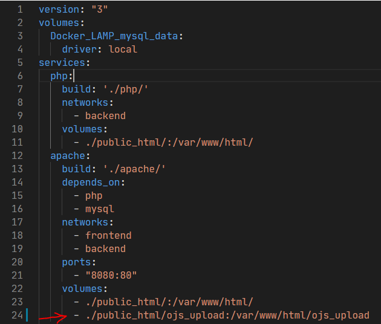

## Angelo's LAMP Docker

This is the LAMP (Linux,Apache,MySQL,PHP) stack on Docker. 

It is my wish to build an easy to use and stable version of LAMP on Docker. The stack versions here might not be the most latest version but I am trying to provide a stable LAMP stack on docker instead.

## PHP version

7.1, 7.2, 7.3, 7.4 

## MySQL version

5.7

## Apache version

2.4

## phpmyadmin version
5.0.2

## How to use

### Folder structure

**/public_html/** - This is the place where you put your LAMP project in it.

**/php/conf/php-ini-overrides.ini** - This is the configuration file where you can override the default PHP ini settings.

**/mysql/conf/config-file.cnf** - This is the file where you make additional configuration parameters for your MySQL server.

**/mysql/data/** - This is the place where your database file stored. 
**NOTE:** This designated shared folder only works on non-Windows environment. It can be enabled via **docker-compose.yml** file.

**/mysql/log/** - This is the place where you can find the log of MySQL server. By default, only slow query will be logged.

**/apache/demo.apache.conf** - This is the file where you can make additional configuration for your Apache server.

### Start LAMP on docker and access to your project

1. Download and install docker on your operating systems
   - Windows - https://docs.docker.com/docker-for-windows/install/
   - MacOS - https://docs.docker.com/docker-for-mac/install/ 
2. Download or clone the source code
3. Unzip(if download) the source code
4. Open the command prompt and change directory to the unzip source code folder **my-lamp-docker-master** . If it's cloned, you can skip this process.
5. Edit the .env from the above folder to specify the timezone and PHP version.
6. Type ***docker-compose up -d*** to start the LAMP stack on docker
7. Type http://localhost:8080/phpinfo.php to verify php interpreter is working successfully. You should be able to see the php information in your browser
8. Type http://localhost:8080/yourawesomeprojectname/ to access your project website
9. To administer your database, type http://localhost:8080/phpmyadmin/ with username "**root**" and password "**passwdmysql**"
10. Type ***docker-compose stop*** to stop the LAMP stack on docker

### FAQ
Q: How do I read the log file for the web server, PHP interpreter and MySQL server?

A: You can simply type ***docker logs -f container_id*** to read the above logs. To list the container id of web server, PHP interpreter and MySQL server, just type ***docker ps -a***

Q: The time in the container is not right. How can I change it?

A: You can change the timezone to your location by modifying Dockerfile located in php, mysql and apache folder.

Q: How do I specify the upload folder for my project?

A: You may follow the instructions as below:

1.	Stop containers by changing directory to the repository folder (***e.g. cd my-lamp-docker***) and then type ***docker-compose stop***

2.	Modify the file docker-compose.yml as below (Line 24)

The above line mentioned how upload folder should be mapped between upload folder on apache container and local folder

3.	Start the LAMP by typing command ***docker-compose up -d*** 
4.	The upload folder will be /var/www/html/ojs_upload, which can be specified in the upload section of your installation page in your project. 
5.	Done!
